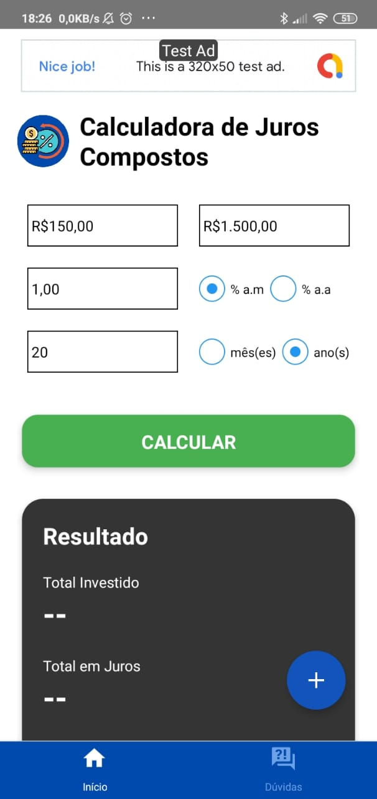
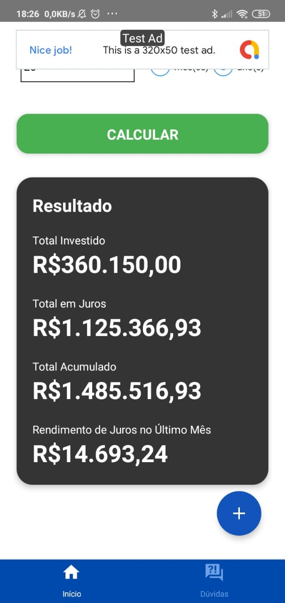
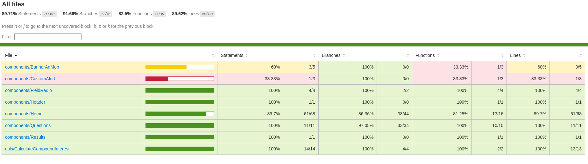

# compound-interest-calculator

A compound interest calculator built with React Native and TypeScript published on Google Play. 

[](http://www.youtube.com/watch?v=JcwI1f-MbQo "App de Calculadora de Juros Compostos")

##




## Link to Store

[Google Play](https://play.google.com/store/apps/details?id=br.com.fiiquedeboa.juroscompostos)

## This application used CI/CD in the AppCenter.

## Running Locally

Connect your cell phone to your computer or open an Android emulator.

```sh
#If you choose to run the app on your mobile, make sure it connected correctly
adb devices -l

#Install dependencies
yarn install

# start the metro server
react-native start
```

Leave the metro server in a separate tab and open a new tab.

```sh
react-native run-android
```

## Running automated tests

```sh
yarn test:coverage
```

Open the html file ./coverage/lcov-report/index.html after running the command test:coverage to view the coverage report in the browser.



